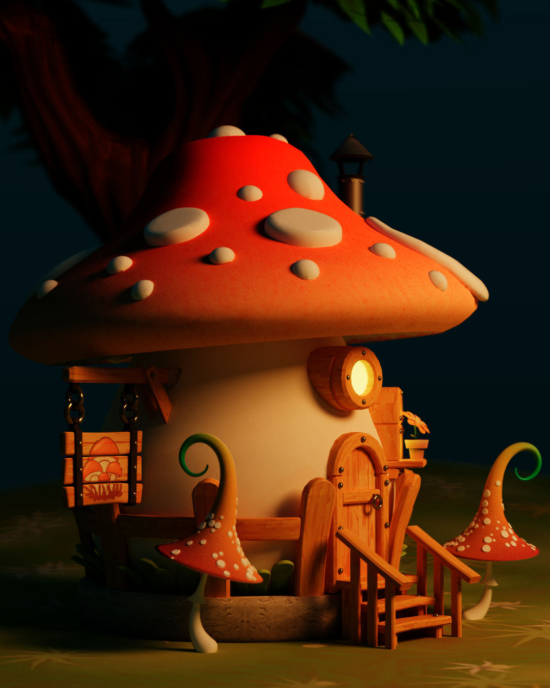
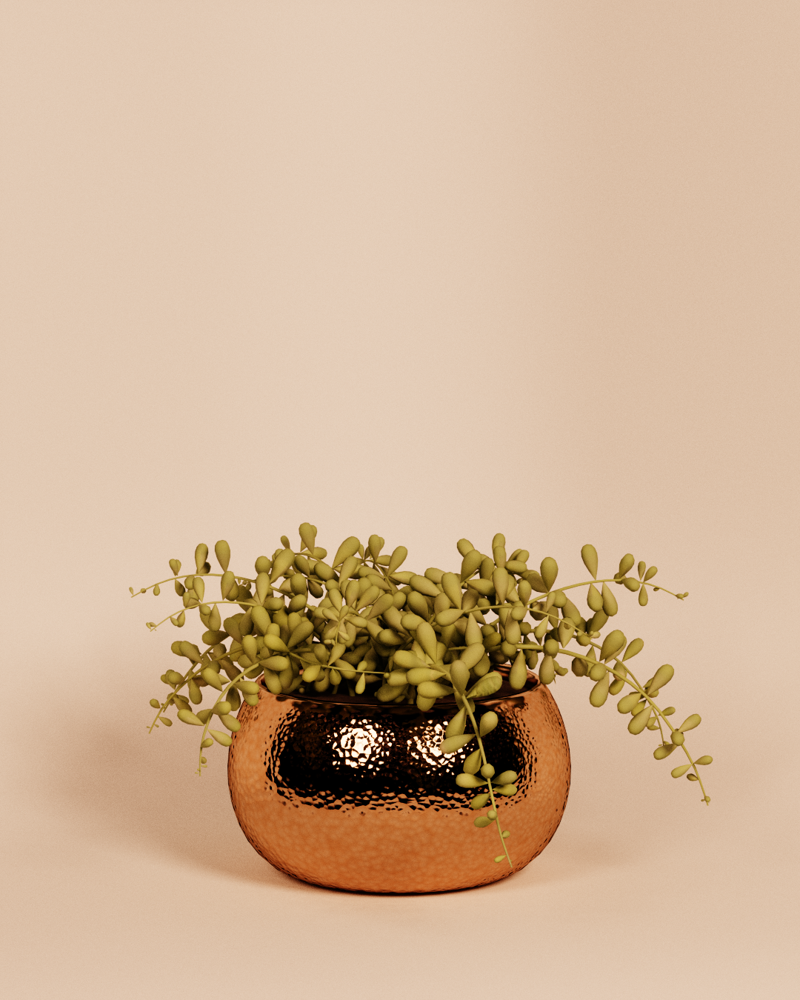
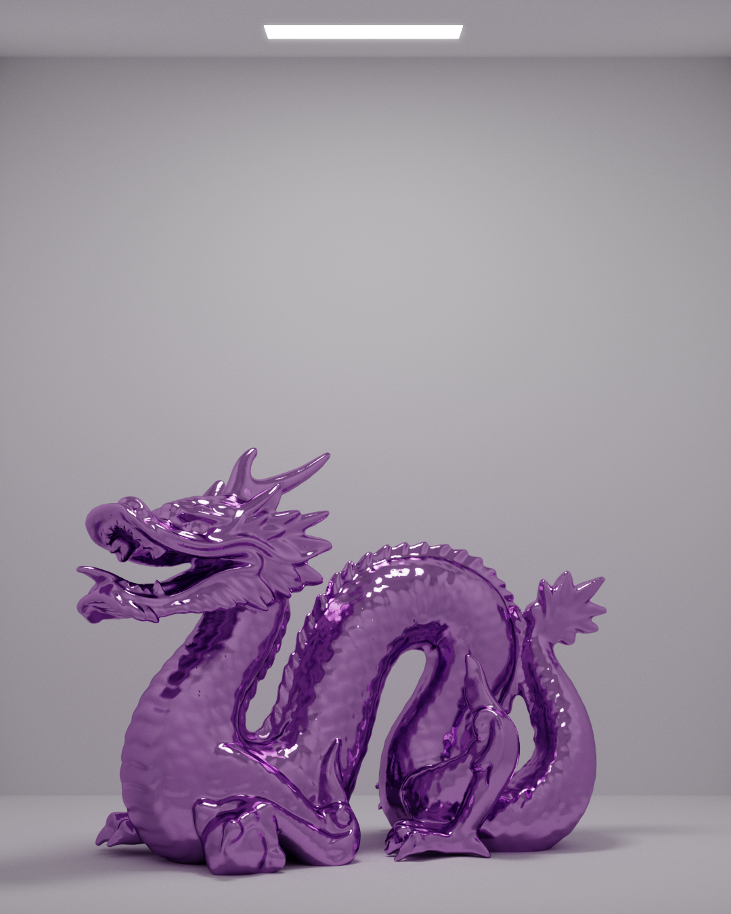

# 👑 Reina

Reina is a Vulkan ray tracer and the successor to [Reina OpenGL](https://www.github.com/alexanderjcs/reina-gl).

## Renders








## Features

* Path tracing of the following materials:
  * Disney BSDF (which can be used to approximate almost any material)
  * Lambertian (diffuse)
  * Metal
  * Transparent dielectric (glass-like)
    * Beer's law for absorption
    * Fresnel reflection and refraction
* Lighting
  * BRDF sampling and next event estimation (NEE) weighted with multiple importance sampling (MIS+NEE)
* OBJ model loading and gLTF support
* Post-processing
  * Tone mapping


## Building

Building Reina is simple. First ensure that the [Vulkan SDK](https://www.lunarg.com/vulkan-sdk/) is installed. Then, clone the repository:
```shell
$ git clone
$ cd reina-vk
```

Then build the project:
```shell
$ cmake -S . -B build
$ cd build
$ cmake --build . --target reina_vk --config Release
```

The executable `reina_vk.exe` is now located in the `Release` directory.

*This project is built and tested on an RTX 3080 with Windows with the MinGW compiler. It should work on other platforms, but it has not been tested. Please [open an issue](https://www.github.com/alexanderjcs/reina-vk/issues) if you are experiencing problems.*
