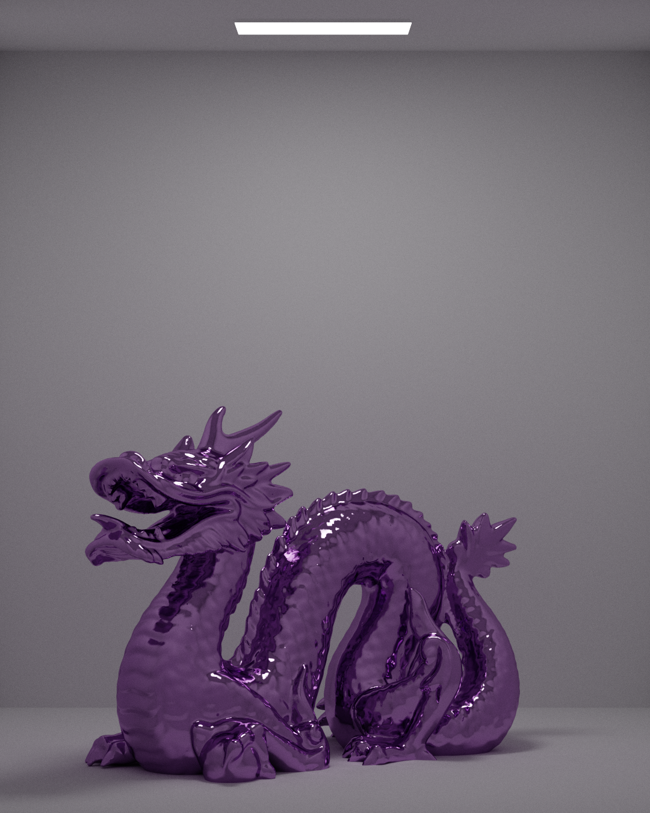
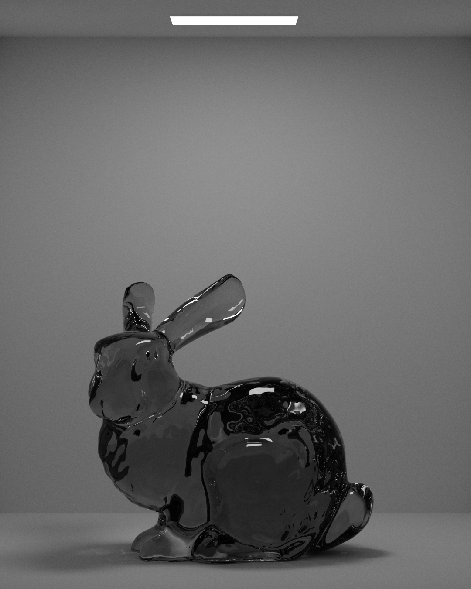

# 👑 Reina

Reina is a Vulkan ray tracer and the successor to [Reina OpenGL](https://www.github.com/alexanderjcs/reina-gl).

## Renders

Render of the Stanford dragon model with 24,000 samples per pixel. It has approximately 1 million triangles and took 25 minutes to render.

Render of the Stanford bunny model with 24,000 samples per pixel. It has approximately 70,000 triangles and took 5 minutes to render.

## Features

* Path tracing of the following materials:
  * Lambertian
  * Metal
  * Dielectric
* Lighting
* OBJ model loading
  * Vertex normal interpolation for smooth shading (this is how the bunny looks so smooth)
