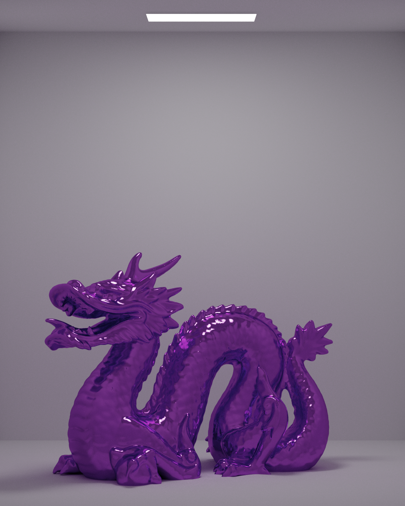
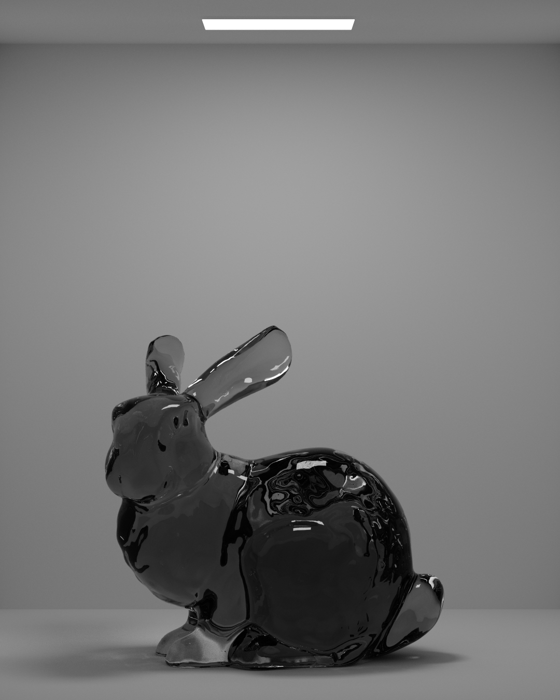

# 👑 Reina

Reina is a Vulkan ray tracer and the successor to [Reina OpenGL](https://www.github.com/alexanderjcs/reina-gl).

## Renders

Render of the Stanford dragon model with 1,200 samples per pixel. It has approximately 1 million triangles and took 30 seconds to render.



Render of the Stanford bunny model with 6,000 samples per pixel. It has approximately 70,000 triangles and took 34 seconds to render.



## Features

* Path tracing of the following materials:
  * Lambertian (diffuse)
  * Metal
  * Transparent dielectric (glass-like)
    * Beer's law for absorption
    * Fresnel reflection and refraction
* Lighting
  * BRDF sampling and next event estimation (NEE) weighted with multiple importance sampling (MIS+NEE)
* OBJ model loading
  * Vertex normal interpolation for smooth shading
* Post-processing
  * Tone mapping


## Building

Building Reina is simple. First ensure that the [Vulkan SDK](https://www.lunarg.com/vulkan-sdk/) is installed. Then, clone the repository:
```shell
$ git clone
$ cd reina-vk
```

Then build the project:
```shell
$ cmake -S . -B build
$ cd build
$ cmake --build . --target reina_vk --config Release
```

The executable `reina_vk.exe` is now located in the `Release` directory.

*This project is built and tested on an RTX 3080 with Windows with the MinGW compiler. It should work on other platforms, but it has not been tested. Please [open an issue](https://www.github.com/alexanderjcs/reina-vk/issues) if you are experiencing problems.*
